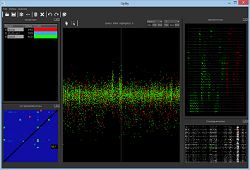

Spiky
=====

*Spiky* is the code name for the next-generation spike-sorting software 
adapted to high-channel count silicon probes. Written in Python, it aims at 
being flexible and extendable by the user.

The first step is to create a new semi-automatic graphical interface
(code name: *KlustaViewa*) for
the manual stage that comes after the automatic clustering algorithms.
This interface automatically guides the user through similar clusters,
showing the most relevant feature projections, and asks him or her to make merge or
split decisions. The goal is to make the manual stage more reliable, less
error-prone and quicker than what it currently is.

This software was developed by Cyrille Rossant in the [Cortical Processing Laboratory](http://www.ucl.ac.uk/cortexlab) at UCL.

Installation
------------

The software is still in developpement, but you can download an experimental
version here.

### Step 1

If you don't already have a Python distribution, install [Enthought Python Distribution](http://www.enthought.com/products/epd.php) (EPD), which is free for academics.

### Step 2

[Download Spiky](http://spiky.rossant.net/spiky-0.1.0.dev.zip)

### Step 3

Unextract this ZIP file in a temporary folder.

### Step 4

  * On Windows, double-click on `windows_install.bat`.
  * On other systems, open a system shell in the temporary directory where
    you extracted the package, and execute the following command:
    `python setup.py install`.

### Step 5

To run the software, execute `spiky` in a system shell.

On Windows, you may need to add `C:\Python27\Scripts` in the PATH variable,
as [described here](http://geekswithblogs.net/renso/archive/2009/10/21/how-to-set-the-windows-path-in-windows-7.aspx).

Gallery
-------

Installation for advanced users
-------------------------------

### Dependencies
  
The following libraries are required:
  
  * Python 2.7
  * Numpy
  * Pandas >= 0.10
  * Matplotlib >= 1.1.1
  * PyOpenGL >= 3.0.1
  * either PyQt4 or PySide

There are two possibilities to install these dependencies.
  
#### Use an all-in-one Python distribution

All these dependencies are included in the 
[Enthought Python Distribution](http://www.enthought.com/products/epd.php) (EPD),
which is free for academics.

#### Install all packages one by one

This solution can be useful if you already have a Python installation and 
only a few packages are missing.

  * On Windows, [find the packages on this webpage](http://www.lfd.uci.edu/~gohlke/pythonlibs/).
  * On OS X, find them on [Homebrew](http://mxcl.github.com/homebrew/) or [Macports](http://www.macports.org/)
  * On Ubuntu, use `apt-get install` with the appropriate package name, which you can find [here](http://packages.ubuntu.com/).

### Installer

[Download Spiky](http://spiky.rossant.net/spiky-0.1.0.dev.zip), extract that package
and execute `python setup.py install`.

### Development version

Use this if you want to be able to update with `git pull` (you need git).

  * Clone the repository:
  
        git clone https://github.com/rossant/spiky.git
  
  * Install Spiky with `pip` so that external packages are automatically
    updated (like `qtools` which contains some Qt-related utility functions):
  
        pip install -r requirements.txt

  
    